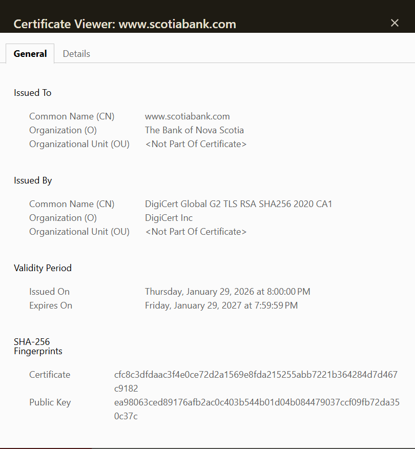

# Week 01 Lab — Certificate Inspection

## Screenshot Evidence

1. Capture a screenshot of the certificate details in your browser.
2. Save it as:

assets/screenshots/week-01/certificate-inspection.png

3. Embed the screenshot below:

## Website Information

**Website inspected:**  
https://www.scotiabank.com

**Issuer (Certificate Authority):**  
DigiCert Inc

**Valid from:**  
Thursday, January 29, 2026

**Valid until:**  
Friday, January 29, 2027

**Signature algorithm:**  
SHA-256 With RSA Encryption

---

## Subject Alternative Names (SAN Entries)

List at least 2–3 SAN entries:

- www.scotiaitrade.com
- www.team.scotiabank.com
- www.scotiawealthmanagement.com

---

## Observations

Document three observations about the certificate.

### Observation 1
The certificate was issued by DigiCert, which is a trusted public Certificate Authority used by many secure websites.

### Observation 2
The certificate includes several Subject Alternative Names (SAN), allowing the same certificate to secure multiple Scotiabank-related domains.

### Observation 3
The certificate was issued by DigiCert, a trusted public Certificate Authority, which allows browsers to verify the authenticity of the website.

---

## Reflection

Based on your inspection, explain how this certificate contributes to secure HTTPS communication.

Reflection

This certificate helps secure HTTPS communication by verifying the identity of the Scotiabank website. It is issued by a trusted Certificate Authority, which allows browsers to trust the website. The certificate also enables encryption so that data exchanged between the user and the website remains private and protected from interception.
