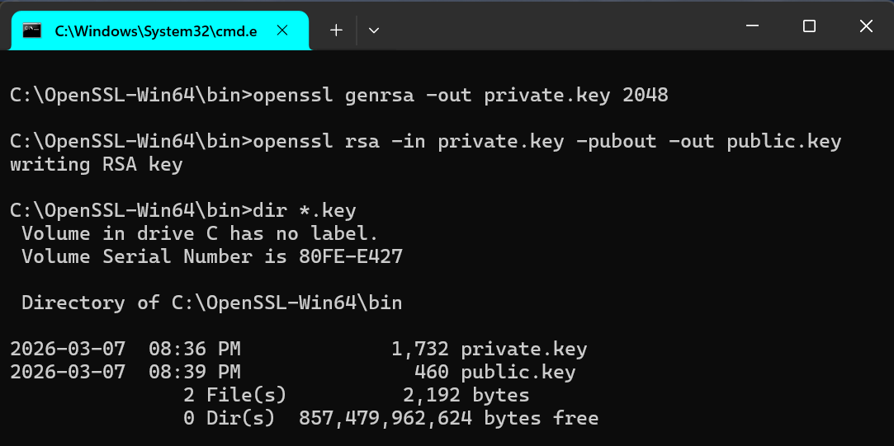

# Week 01 Lab — Key Pair Generation

## Screenshot Evidence

****

---

## Key Properties
- The public key can be shared because it is used to encrypt data or verify digital signatures. It cannot reveal the private key.
- The private key is sensitive because it is used to decrypt data and create digital signatures.

---

## Security Scenario
What would happen if someone obtained your private key?
If someone obtained the private key, they could pretend to be the real owner of the key.

 Risk in terms of:
  - Identity
They could claim the identity of the key owner.

  - Impersonation
They could create fake signatures or decrypt secure messages.

  - Trust
Trust in the system would be broken because others could not verify the real identity.

---

## Observations

### Observation 1
The public key was extracted from the private key using OpenSSL.

### Observation 2
The key size (2048 bits) determines the strength of the encryption.

### Observation 3
The public key is shorter and meant to be shared, while the private key is longer and must remain secret.

---

## Reflection

Why must the private key remain secret in a PKI system?

In a PKI system, the private key must remain secret because it represents the identity of the key owner. Possession of the private key allows a user to decrypt encrypted data and create valid digital signatures. If the private key is compromised, an attacker could impersonate the legitimate entity and undermine trust in secure communications. Protecting the private key is therefore essential to maintaining the integrity of the PKI trust model.
