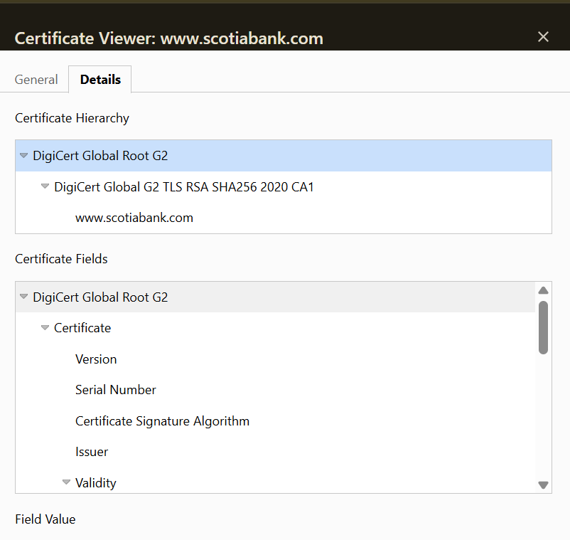

# Week 01 Mini Lab — Trust Chain Validation

## Screenshot Evidence

## Website Information

**Website inspected:**  
http://www.scotiabank.com

---

## Certificate Chain Breakdown

**Leaf (Server) Certificate**  
http://www.scotiabank.com

**Intermediate Certificate Authority**
DigiCert Global G2 TLS RSA SHA256 2020 CA1

**Root Certificate Authority (Trust Anchor)**
DigiCert Global Root G2

---

## Trust Anchor Verification

Is the Root CA marked as trusted by your system?

Yes
The trust comes from the operating system and browser root certificate store, which contains trusted certificate authorities.

---

## Observations

### Observation 1
The certificate chain shows how the website certificate links to a trusted root certificate.

### Observation 2
An intermediate certificate authority is used instead of issuing certificates directly from the root CA.

### Observation 3
The browser automatically validates the certificate chain before establishing a secure HTTPS connection, and nd no security warning appears because the certificate is trusted.

---

## Reflection

The root certificate is called a trust anchor because it is the starting point of trust in the certificate validation process. When a browser validates a website certificate, it checks the certificate chain from the server certificate to the intermediate certificate and finally to the trusted root certificate. If the root certificate is trusted by the system, the connection is considered secure. If the root certificate were not trusted, the browser would show a security warning.
