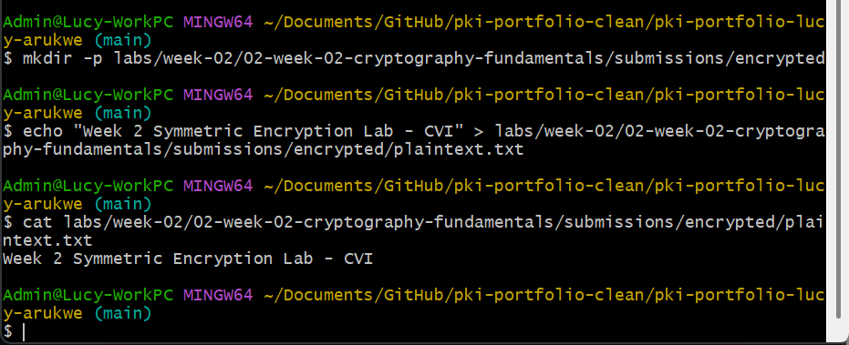
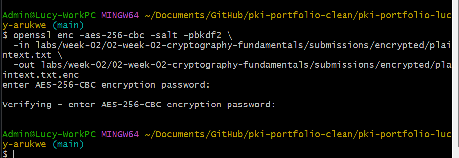
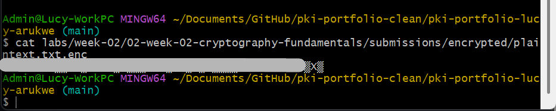
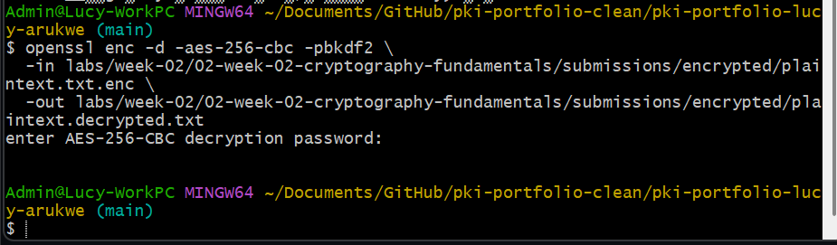
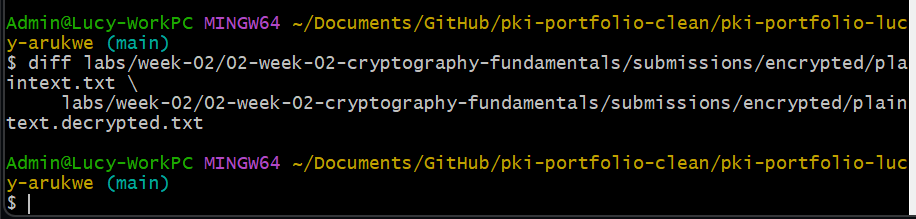

# Lab — Symmetric Encryption

## Overview
This lab explored symmetric encryption using AES-256-CBC to understand the security property of `confidentiality.` A plaintext file was encrypted, the resulting ciphertext was observed, and the file was then decrypted back to its original form. The output was verified to match the original, demonstrating the correctness of the encryption and decryption process.

---

## Environment

- Operating System: Windows 11
- Terminal Used: Git Bash (MINGW64) 
- OpenSSL Version: OpenSSL 3.5.5 27 Jan 2026

---

## Steps Performed
1. Created the directory structure `labs/week-02/02-week-02-cryptography-fundamentals/submissions/encrypted/` to store the lab files.  
2. Created a plaintext file containing the message "Week 2 Symmetric Encryption Lab - CVI".  
3. Encrypted the plaintext file using AES-256-CBC with salt and PBKDF2 key derivation, providing a password when prompted.  
4. Observed the encrypted output, which appeared as unreadable binary ciphertext.  
5. Decrypted the encrypted file using the same password, producing a decrypted output file.  
6. Used the `diff` command to verify that the decrypted file matched the original plaintext.
   
---

## Results

Plaintext file created and verified:

Encryption process:

Encrypted file output (ciphertext):

Decryption process:

Verification using diff:

---

## Key Findings
AES-256-CBC with PBKDF2 key derivation successfully transformed readable plaintext into unreadable ciphertext.  
The `-salt` option introduced randomness, ensuring that encrypting the same file with the same password produces different ciphertext each time, which helps prevent pattern analysis attacks.  
Decryption is only possible with the exact password used during encryption.  
The successful `diff` result confirmed that encryption and decryption are inverse operations with no data loss.  

---

## Explanation

Symmetric encryption ensures confidentiality by allowing only users with the correct key or password to access the data. The encryption process converts plaintext into ciphertext, making it unreadable to unauthorized users. AES-256 is considered computationally infeasible to brute-force with current technology, making it the standard for protecting data at rest and in transit. 
If the wrong password were used during decryption, OpenSSL would produce a "bad decrypt" error because the derived key would be incorrect, resulting in garbage output or a failed operation.
In real-world systems like TLS, symmetric encryption is used after a secure connection is established because it is fast and efficient for protecting large amounts of data.

---

## Challenges / Troubleshooting
One minor challenge was ensuring the correct file paths were used during encryption and decryption. This was resolved by verifying the directory structure and confirming file locations before running commands. No major errors occurred during the process.

---

## Artifacts
- plaintext.txt — original plaintext file
- plaintext.txt.enc  — AES-256-CBC encrypted ciphertext
- plaintext.decrypted.txt — decrypted output file

Screenshots are stored in ``assets/screenshots/``

---

*CVI PKI Career Pathway — Foundations Phase*
