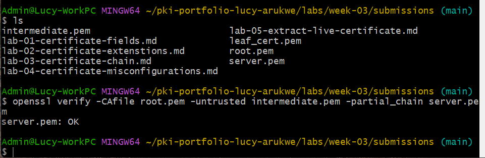

# Lab 03 — Verify a Certificate Chain

## Overview
This lab involved retrieving and inspecting the full certificate chain from github.com using OpenSSL. Each certificate in the chain was saved and analyzed individually to identify its role as a leaf, intermediate, or root certificate. The chain was then verified using OpenSSL to confirm that trust was established from the server certificate up to the root CA. The PKI concept explored in this lab is how certificate chains establish trust in TLS connections.
---

## Environment
- OS: Windows 11
- Terminal used: Git Bash (MINGW64)
- OpenSSL version: `OpenSSL 3.5.5 27 Jan 2026`
- Website used: github.com

---

## Steps Performed

1. Connected to github.com using `openssl s_client -showcerts` and captured the full certificate chain output
2. Extracted and saved three separate certificates: server.pem (leaf), intermediate.pem, and root.pem
3. Verified the certificate chain using `openssl verify -CAfile root.pem -untrusted intermediate.pem server.pem` — received `server.pem: OK`, confirming the chain validates against the intermediate certificate
4. Inspected each certificate using `openssl x509 -text -noout` to identify Subject, Issuer, and CA:TRUE/FALSE fields

---
## Chain Verification Result
Paste the output of your `openssl verify` command: `server.pem: OK`

---

## Certificate Roles
| Certificate        | Subject                                       | Issuer                                         | CA:TRUE/FALSE |
|--------------------|-----------------------------------------------|------------------------------------------------|---------------|
| server.pem         | github.com                                    | Sectigo Public Server Authentication CA DV E36 | FALSE         |
| intermediate.pem   | Sectigo Public Server Authentication CA DV E36| Sectigo Public Server Authentication Root E46  | TRUE          |
| root.pem           | Sectigo Public Server Authentication Root E46 | Sectigo Public Server Authentication Root E46  | TRUE          |
---

## Results

The OpenSSL chain verification command confirmed the certificate chain is valid:
`server.pem: OK`

This output indicates:
- The leaf certificate (server.pem for github.com) was successfully signed by the intermediate CA
- The intermediate CA certificate was successfully signed by the root CA
- The root CA is trusted (either manually via `-CAfile` or through the system trust store)

---
## Observations

1. Which certificate is the root CA?
root.pem — Sectigo Public Server Authentication Root E46.  
It has CA:TRUE, meaning it can issue other certificates, and it is self-signed (its Subject and Issuer are the same), which makes it the top-level trust anchor in the chain.

2. Which is the intermediate CA?
intermediate.pem — Sectigo Public Server Authentication CA DV E36.  
It has CA:TRUE, which means it is authorized to act as a certificate authority and can sign other certificates. It is signed by the root CA and serves as a middle layer in the chain of trust.

3. Which is the leaf certificate?
server.pem — CN=github.com.  
It has CA:FALSE, meaning it cannot issue or sign other certificates. It is used only for identification, such as authenticating the website during a TLS connection, and is signed by the intermediate CA.

4. How does the Issuer field connect the chain?
Each certificate’s Issuer field matches the Subject of the certificate above it in the chain. The leaf certificate is issued by the intermediate CA, and the intermediate is issued by the root CA. This creates a chain of trust that links the server certificate back to a trusted root.

5. Why do intermediate certificates exist?
Intermediate certificates exist to improve security and protect the root CA. Even though both root and intermediate certificates have CA:TRUE, the root CA is kept highly secure and is not used for everyday signing. Instead, intermediate CAs are used to issue certificates. If an intermediate is compromised, it can be revoked without affecting the root CA or the entire trust system.

---

## Key Findings

1. The root CA (Sectigo Public Server Authentication Root E46) is self-signed — its Subject and Issuer fields are identical, making it the ultimate trust anchor
2. Each certificate's Issuer field matches the Subject of the certificate that signed it, creating an unbroken chain of trust from the leaf to the root
3. The leaf certificate has CA:FALSE, preventing it from signing other certificates, while both the intermediate and root have CA:TRUE, allowing them to issue certificates
4. When attempting manual verification with a downloaded root certificate, the chain failed to validate. However, using the system trust store (by omitting the `-CAfile` flag or using Mozilla's CA bundle) allowed verification to succeed. This demonstrates that operating systems maintain their own curated trust stores containing pre-approved root CAs. The system trust store worked because it already contained the Sectigo root CA, while the manually downloaded root may have been incomplete or required additional chain validation that OpenSSL couldn't resolve without access to the full system trust infrastructure

---

## Challenges / Troubleshooting
There was no challenges/issues encountered.
