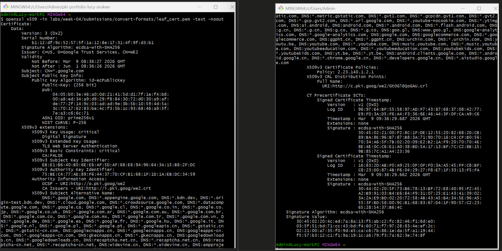
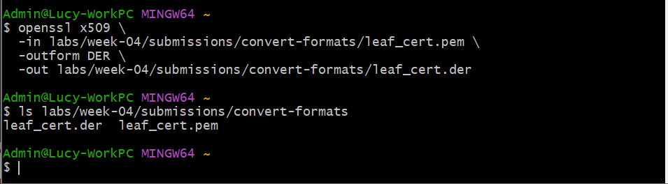
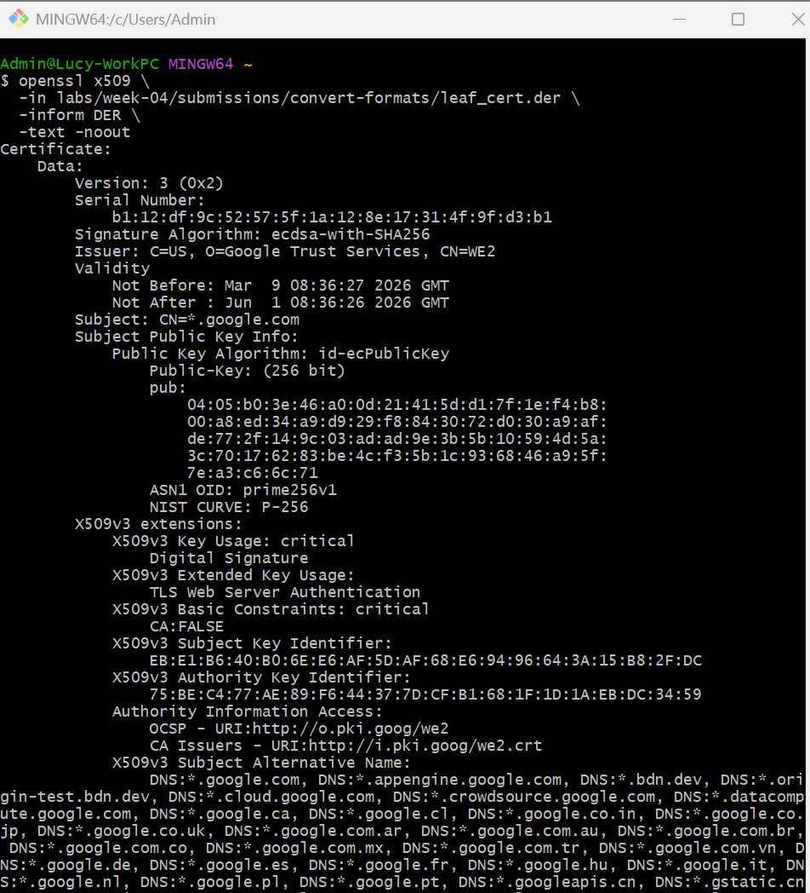
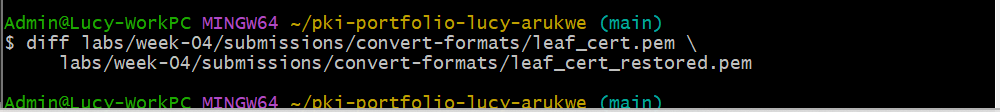
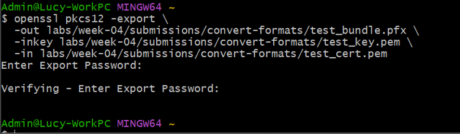
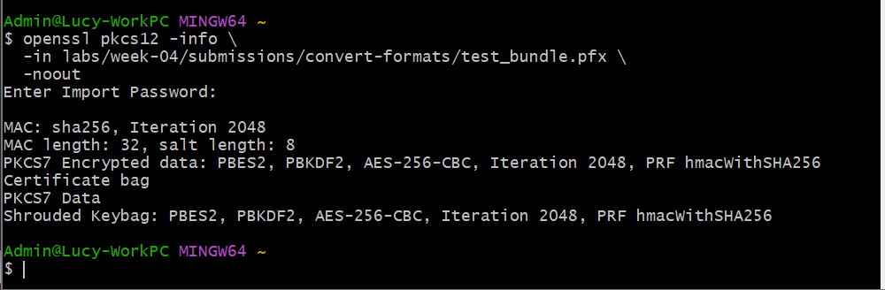

# Lab 01 — Convert Certificate Formats

## Overview
This lab explores how digital certificates are stored and encoded in different formats; PEM, DER, and PFX. A live certificate was retrieved from Google and converted between formats using OpenSSL to observe how encoding changes while the certificate data remains the same. A self-signed certificate was also created and bundled with a private key into a PFX file to demonstrate how certificates are packaged in real-world scenarios.

---

## Environment
- Operating System: Windows 11
- Terminal Used: Git Bash (MINGW64)
- OpenSSL Version (`OpenSSL 3.5.5 27 Jan 2026`):

---

## Steps Performed

1. Connected to google.com using `openssl s_client` and retrieved the leaf certificate in PEM format, saving it as `leaf_cert.pem`
2. Inspected the PEM file using `openssl x509 -text -noout` to confirm it parsed correctly and to review certificate details such as issuer, subject, and validity
3. Converted `leaf_cert.pem` into binary DER format using `openssl x509 -outform DER`, producing `leaf_cert.der`
4. Converted the DER file back into PEM format to verify that the conversion process preserved the certificate data, then compared both files using `diff`
5. Generated a test RSA key pair and self-signed certificate, then bundled them into a PFX file using `openssl pkcs12 -export`, protected with a password
   
---

## Results

PEM vs DER appearance:
The PEM file is human-readable and contains Base64-encoded data enclosed between clearly defined certificate boundaries. In contrast, the DER file appears as unreadable binary data when opened in a text editor, as it uses a raw binary encoding format.

diff output:
The diff comparison showed minor differences related to formatting, such as line endings. However, the underlying certificate data remained unchanged, confirming that the conversion between formats was lossless.

PFX verification:
The `openssl pkcs12 -info` command confirmed that the PFX bundle was valid. After entering the password, the output displayed certificate information and verified the integrity of the bundled data.

## PEM Inspection:

## DER Conversion:

## DER Verification:

## Diff Output:

## PFX Creation:

## PFX Verification:

---

## Key Findings
- PEM is Base64-encoded and human-readable, while DER is binary and not human-readable
- PEM and DER represent the same certificate data using different encoding formats
- Converting between PEM and DER does not alter the certificate content
- PFX bundles a certificate and its private key into a single password-protected file
- Private keys must never be stored in public repositories, as they can be used to impersonate systems or decrypt sensitive data
  
---

## Explanation
Why does a PFX require a password?
A PFX file contains both a certificate and its associated private key. Because the private key represents identity and must remain confidential, the PFX is encrypted with a password to prevent unauthorized access.

PEM vs DER vs PFX — when would each be used?
PEM is commonly used in Linux and web server environments because it is easy to read and configure. DER is used in systems that require a binary format, such as certain Windows and Java applications. PFX is used when both the certificate and private key need to be transferred together securely, such as when installing certificates on servers or importing them into applications.

Why must private keys never be committed to GitHub?
A private key is the core element of identity in PKI. If exposed, it allows unauthorized parties to impersonate the certificate owner, intercept encrypted communications, or sign malicious data. Once a private key is compromised, it must be revoked and replaced immediately.

---

## Challenges / Troubleshooting
During the comparison step, the `diff` command produced output even though both certificates were expected to be identical after conversion. This initially appeared incorrect, since a successful round-trip conversion (PEM → DER → PEM) should not change the certificate data.

The difference was caused by formatting variations, not actual changes in the certificate itself. Specifically, differences such as line endings (LF vs CRLF) and text encoding can cause `diff` to report changes even when the underlying certificate content is the same.

To confirm whether the certificates were truly identical, a fingerprint comparison was performed using:

`openssl x509 -in leaf_cert.pem -noout -fingerprint`
`openssl x509 -in leaf_cert_restored.pem -noout -fingerprint`

The fingerprints matched exactly, confirming that both certificates contain the same cryptographic data. This demonstrated that the conversion process was successful and lossless, and that the diff output reflected formatting differences rather than actual data changes.

---

## Artifacts

| File                     | Description                                     |
|--------------------------|-------------------------------------------------|
| `leaf_cert.pem`          | Live leaf certificate retrieved from google.com |
| `leaf_cert.der`          | PEM certificate converted to binary DER format  |
| `leaf_cert_restored.pem` | DER certificate converted back to PEM           |
| `test_cert.pem`          | Self-signed test certificate                    |
| `test_bundle.pfx`        | Password-protected PFX bundle                   |
