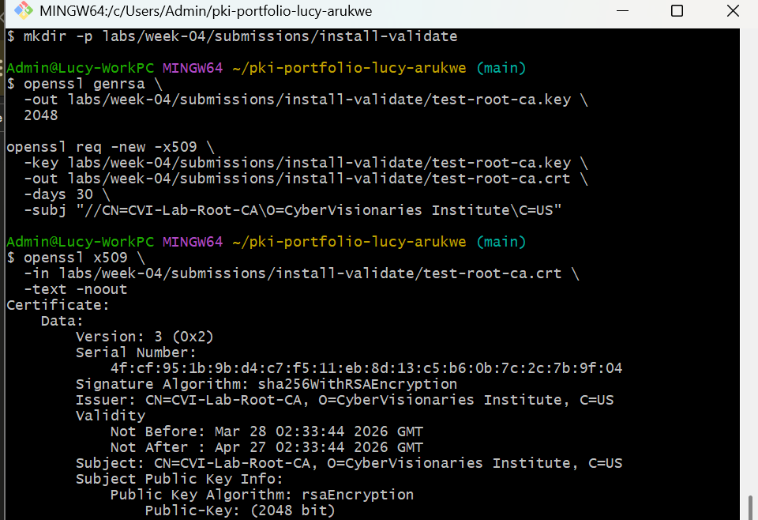
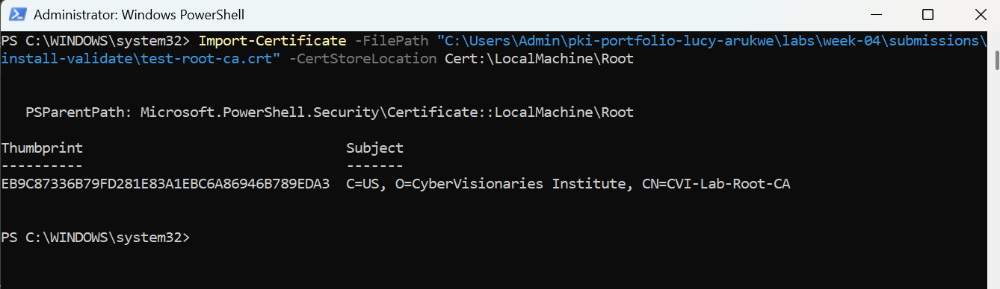
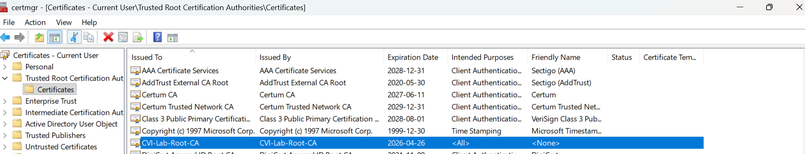
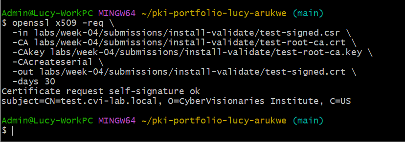
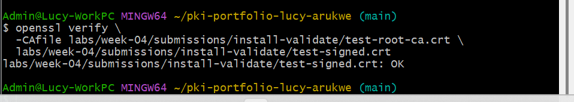
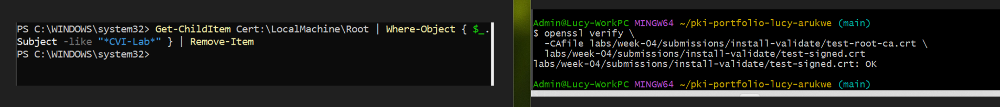

# Lab 03 — Install a Certificate and Validate Trust (Stretch)

## Overview
This lab focused on understanding how trust is established by installing a root Certificate Authority (CA) on a system. A self-signed root CA was created and used to sign another certificate, then installed into the system trust store to observe how trust validation changes. The goal was to understand how certificate chains are built and how systems determine whether a certificate is trusted.

---

## Environment
- Operating System: Windows 11
- Terminal Used: Git Bash (MINGW64) and Windows PowerShell (Administrator)
- OpenSSL Version: `OpenSSL 3.5.5 27 Jan 2026`
  
---

## Steps Performed

1. Generated a self-signed root CA certificate using OpenSSL with a 30-day validity period
2. Installed the root CA into the Windows Local Machine trust store using the Import-Certificate cmdlet in an elevated PowerShell session
3. Verified the installation visually in certmgr.msc under Trusted Root Certification Authorities
4. Generated a subordinate private key and certificate signing request (CSR), then signed it using the root CA to produce a leaf certificate
5. Validated the certificate chain using openssl verify with a provided CA file, confirming a successful result (OK)

---

## Results

Root CA Verification Output:
The root CA inspection showed that the Subject and Issuer fields were identical, both showing 
`CN=CVI-Lab-Root-CA, O=CyberVisionaries Institute, C=US` confirming it is a self-signed certificate. The validity period reflected the configured 30-day duration.

Trust Chain Validation with CAfile:

`test-signed.crt: OK`

This confirmed that the signed certificate successfully chained up to the 
test root CA.

After Root CA Removal:

`error 20 at 0 depth lookup: unable to get local issuer certificate`

Verification failed because the system no longer trusted the root CA after it was removed from the trust store.

Trust Chain Confirmation:
Successful verification (when trusted) confirmed that the certificate chain was correctly built from the signed certificate back to the root CA.

## Root CA Generated:

## Root CA Installed via PowerShell:

## Root CA Visible in certmgr.msc:

## Signed Certifcate Created:

## Trust Chain Validated:

## Root CA Removed via PowerShell:

---

## Key Findings
A root CA is identified by its Subject and Issuer being identical — it 
  signs itself because there is no higher authority above it
- Installing a root CA into the OS trust store causes the system to 
  automatically trust any certificate that chains up to it, with no 
  user interaction required
- OpenSSL's `-CAfile` flag performs file-based verification and does not 
  query the OS trust store — these are two separate trust mechanisms
- Removing a root CA from the trust store immediately revokes system-level 
  trust for all certificates it issued, without modifying those certificates
  
---

## Explanation
What made the test root CA self-signed?
A root CA is self-signed because it has no parent authority above it. When 
inspecting the certificate with `openssl x509 -text -noout`, the Subject and 
Issuer fields were identical. This is the definitive indicator of a root CA, it vouches for itself and is trusted purely because it has been explicitly 
added to the trust store.

After installing the root CA on the system, the Windows Local Machine Root certificate store gained a new entry,
CVI-Lab-Root-CA. From that point forward, Windows and any application that 
uses the Windows trust store would automatically trust any certificate signed 
by that CA without showing any warnings. This is exactly how enterprise 
internal CAs work.

In an enterprise environment, who controls root CAs?
System administrators and security teams control trusted root CAs using tools such as Group Policy or mobile device management (MDM). 
This ensures only approved certificate authorities are trusted across all devices.

Why is it a security concern if an attacker can install a root CA?
If an attacker gains Administrator access and installs a rogue root CA, they can issue certificates that the device trusts completely. This enables man-in-the-middle attacks on HTTPS traffic — the user sees a padlock and no warnings, but all encrypted traffic is being intercepted and decrypted. This is why monitoring trust store changes is a critical security control, and why least-privilege access to administrator accounts is essential.

---

## Challenges / Troubleshooting
During validation, verification initially returned a successful result even after the root CA had been removed from the Windows trust store. This appeared incorrect because trust was expected to be removed.

The behavior was caused by the use of the -CAfile option in the OpenSSL verification command. When this option is used, OpenSSL does not rely on the system trust store and instead uses the provided CA file as the trust anchor. As a result, verification continued to succeed because the root CA was still being supplied manually.

After identifying this, verification was repeated without specifying a CA file:

`openssl verify labs/week-04/submissions/install-validate/test-signed.crt`

This time, the command failed, confirming that the root CA had been successfully removed from the system trust store.

---

## Artifacts

| File                | Description                           |              
|---------------------|---------------------------------------|
| `test-root-ca.crt`  |Self-signed test root CA certificate   |
| `test-signed.crt`   |Certificate signed by the test root CA |

