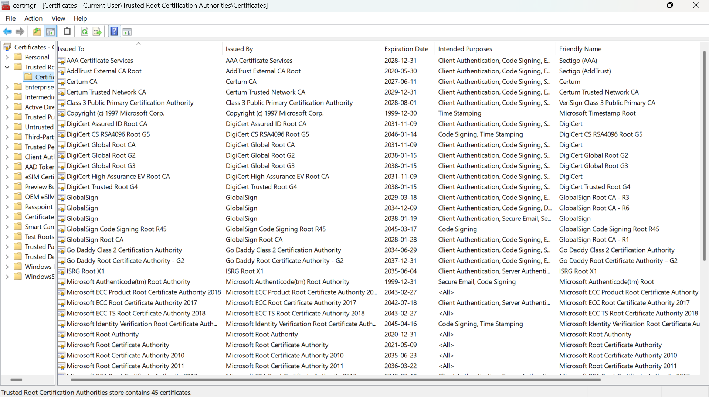
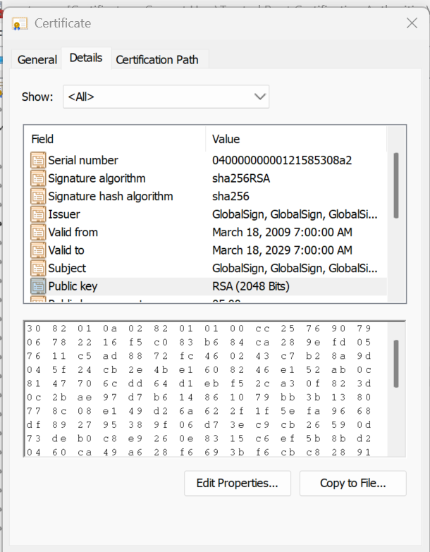
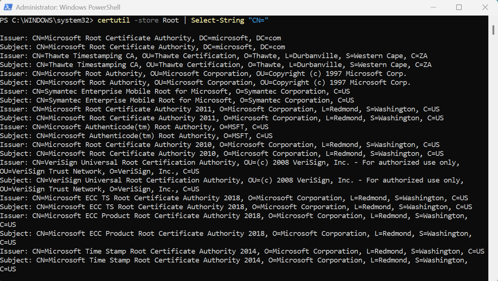

# Lab 02 — Inspect Your Trust Store

## Overview
This lab explores where trusted root Certificate Authorities (CAs) are stored on a Windows operating system and how the trust store works in practice. The Windows Certificate Manager and PowerShell are used to locate and inspect trusted root CAs, while OpenSSL is used to validate a live certificate against the system’s trust store. The goal is to understand how browsers and operating systems automatically decide which certificates to trust.

---

## Environment
- Operating System: Windows 11
- Terminal Used: Git Bash (MINGW64) and Windows PowerShell
- OpenSSL Version: `OpenSSL 3.5.5 27 Jan 2026`

---

## Steps Performed

1. The Windows Certificate Manager (certmgr.msc) was opened and navigated to Trusted Root Certification Authorities to view all pre-installed root CAs
2. The GlobalSign root CA certificate was selected and inspected through the Details tab to review its Subject, Issuer, validity period, and public key algorithm
3. PowerShell was used to run certutil -store Root | Select-String "CN=" to list all trusted root CA Common Names from the command line
4. OpenSSL was used to connect to google.com and validate its certificate chain against the system’s trust store

---

## Results
Trusted Root CAs found: 45

Root CA Inspected — GlobalSign Root CA:

Subject: GlobalSign
Issuer: GlobalSign (self-signed — root CA)
Valid From: March 18, 2009
Valid To: March 18, 2029
Signature Algorithm: SHA256RSA
Public Key: RSA (2048 Bits)

Trust Validation Output:
The OpenSSL command `openssl s_client -connect google.com:443 -verify_return_error` returned:

`Verify return code: 0 (ok)`

This confirms that the certificate presented by Google was successfully validated against the system’s trusted root store. The connection negotiated TLS 1.3 using the TLS_AES_256_GCM_SHA384 cipher suite, and the certificate was issued to `*.google.com` by Google Trust Services (CN=WR2).

## Certificate Manager — Trusted Root CAs:

## GlobalSign Root CA Details:

## certutil CN= Output:

---

## Key Findings

- Windows includes a large number of pre-installed trusted root CAs from organizations such as Microsoft, GlobalSign, VeriSign, Thawte, and Symantec
- Root CAs are self-signed, meaning the Subject and Issuer are identical and trust is established by inclusion in the operating system
- Root certificates typically have long validity periods, often spanning decades
- Certificate validation works by building a trust chain from the server certificate to a trusted root CA
- Trust in PKI ultimately depends on which root CAs are included in the system trust store
  
---

## Explanation

Why does a browser trust a certificate from a website that has never been visited before?
Browsers rely on the operating system’s trust store, which already contains a list of trusted root Certificate Authorities. When a website presents a certificate, it is validated by checking whether it chains back to one of these trusted roots. If a valid chain exists, the certificate is trusted automatically without any user action.

What would happen if an enterprise's internal root CA was NOT in the trust store?
Certificates issued by that internal CA would not be trusted. This would result in browser warnings or connection errors when accessing internal services. To prevent this, organizations distribute their internal root CA to all devices so that internal certificates can be validated properly.

What is notable about how many roots are pre-installed?
A large number of root CAs are trusted by default on a standard system. This means multiple external organizations are inherently trusted to issue certificates. This highlights the importance of monitoring and managing the trust store, as trust in PKI depends entirely on which root CAs are accepted by the system.

---

## Challenges / Troubleshooting
No major technical issues were encountered during this lab. All commands executed successfully, and the trust validation completed as expected. Additional attention was required to interpret certificate fields and understand how the certificate chain relates to the system trust store.

---

## Artifacts

- screenshots are stored in assets/screenshots/week-04/
