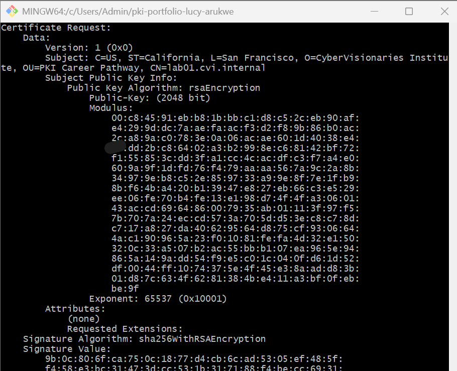
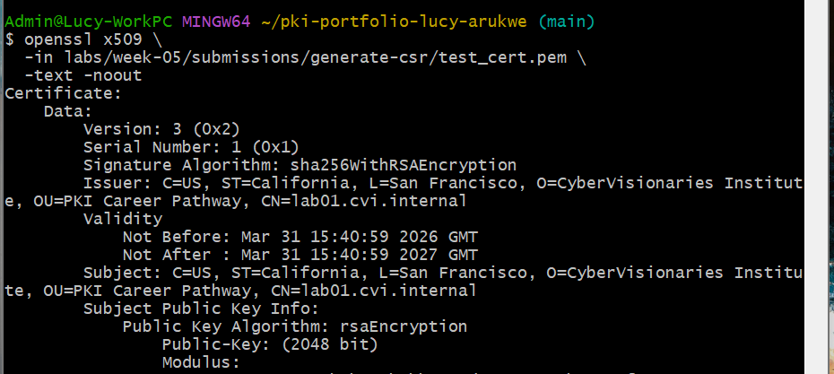
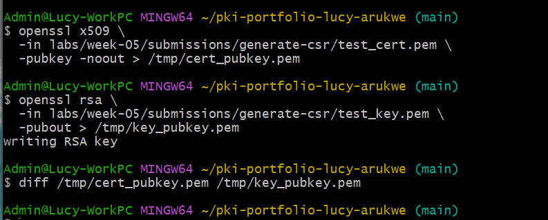

# Lab 01 — Generate a CSR and Simulate the Issuance Workflow

## Overview
This lab focused on understanding how a digital certificate is created from start to finish. I explored the complete certificate issuance workflow: generating a private key, creating a Certificate Signing Request (CSR), and signing it to produce a certificate. This hands-on experience reinforced how identity information and public keys are packaged into a CSR and how a Certificate Authority (CA) would process and sign that request in production.

The core PKI concept being investigated was `the certificate request and issuance lifecycle` — specifically how the Subject information flows from the CSR into the final certificate, and how the private key, CSR, and certificate are cryptographically linked.

---

## Environment
- Operating System: `Windows 11`
- Terminal Used: `Git Bash (MINGW64)`
- OpenSSL Version: `OpenSSL 3.5.5 27 Jan 2026`

---

## Steps Performed

1. Generated a 2048-bit RSA private key using `openssl genrsa` and confirmed its structure using `openssl rsa -text -noout`
2. Created a CSR interactively using the private key by running `openssl req -new` and manually entering the Subject fields.
Each of these fields represents identity information about the entity requesting the certificate.
3. Inspected the CSR using `openssl req -text -noout` to verify all Subject fields and the embedded public key
4. Self-signed the CSR to simulate a CA issuing a certificate, creating `test_cert.pem` with a 365-day validity period
5. Inspected the signed certificate using `openssl x509 -text -noout` to examine the Subject, Issuer, Validity window, and Public Key
6. Extracted and compared public keys** from both the certificate and the private key to confirm they belong to the same key pair.
Extracted the public keys from both the certificate and the private key, then compared them using the `diff` command:

   `openssl x509 -in labs/week-05/submissions/generate-csr/test_cert.pem -pubkey -noout > /tmp/cert_pubkey.pem`  
   `openssl rsa -in labs/week-05/submissions/generate-csr/test_key.pem -pubout > /tmp/key_pubkey.pem  
   diff /tmp/cert_pubkey.pem /tmp/key_pubkey.pem`  

---

## Results
- The CSR contained the following Subject fields:

| Field | Abbreviation | Value in CSR |
|-------|--------------|--------------|
| Common Name | CN | lab01.cvi.internal |
| Organization | O | CyberVisionaries Institute |
| Organizational Unit | OU | PKI Career Pathway |
| Country | C | US |
| State | ST | California |
| Locality | L | San Francisco |

- In a self-signed certificate, the Issuer field is the same as the Subject. This is because the certificate is signed using its own private key rather than by a Certificate Authority. Since the same entity both owns and signs the certificate, its identity appears in both fields.
  
- The `diff` command produced no output, which indicates that both public keys are identical. 
This confirms that:
    - The certificate was generated from the same private key  
    - The key pair relationship is valid  
    - The certificate can be used correctly for encryption and verification  
  
- The signed certificate follows the X.509 structure from Week 3, where the Subject identifies the entity, the Issuer establishes trust, the Validity defines the trust period and the Public Key enables secure communication/cryptographic operations. This lab showed how those fields come together to create and verify a digital identity.

### Certificate Field Analysis

`Subject:` C=US, ST=California, L=San Francisco, 
           O=CyberVisionaries Institute, 
           OU=PKI Career Pathway, 
           CN=lab01.cvi.internal
The Subject field matches the values defined in the CSR, confirming that the identity information was correctly carried over during certificate creation.
 
`Issuer:` C=US, ST=California, L=San Francisco, 
          O=CyberVisionaries Institute, 
          OU=PKI Career Pathway, 
          CN=lab01.cvi.internal
The Issuer is identical to the Subject because this is a self-signed certificate. The certificate was signed using its own private key rather than by a Certificate Authority.


`Validity:`Not Before: Mar 31 15:40:59 2026 GMT
           Not After : Mar 31 15:40:59 2027 GMT
The validity period is set by the `-days 365` flag, meaning the certificate is valid for one year. It can only be trusted between the “Not Before” and “Not After” dates, outside this period; it is considered invalid.

`Public Key:` Public Key Algorithm: rsaEncryption
              Public-Key: (2048 bit)
              Modulus: [2048-bit number]
              Exponent: ----(0x10001)
The certificate uses RSA (2048-bit), and the public key was derived directly from the private key used to generate the CSR.











---

## Key Findings
• An empty `diff` result means both public keys are identical. This confirms that the certificate was generated from `test_key.pem` and that they belong to the same key pair.

What this proves:
The private key, CSR, and certificate are all linked. This means the certificate can be used correctly with the private key for encryption and signature verification. If the keys did not match, the certificate would not work.

• A CSR is a formal request for a certificate** — it contains identity information (Subject fields) and a public key, but it does not establish trust on its own. Trust is established when a CA signs the CSR and issues a certificate.

• The certificate is cryptographically linked to the private key through its public key  

• Self-signed certificates have matching Subject and Issuer fields because they are signed by the same entity  

---

## Explanation
A CSR is used to request a certificate from a Certificate Authority (CA). It contains the public key and identity details, but never the private key.

The private key must remain secret because it is used to prove identity, decrypt data, and create digital signatures. If it were exposed, anyone could impersonate the certificate owner and compromise secure communication.

The CA only needs the public key from the CSR to generate and sign the certificate. This allows trust to be established without ever exposing the private key.

If the public key in the certificate did not match the private key, the certificate would not function. Secure connections, encryption, and signature verification would all fail because the key pair relationship would be broken.

---

## Challenges / Troubleshooting
### Challenge 1: Multi-line commands failed with backslash continuation
`Issue:` When attempting to use the command-line `-subj` option with backslashes for line continuation, Git Bash on Windows threw syntax errors. The commands from the lab instructions didn't work:

`openssl req -new \
  -key test_key.pem \
  -out test_csr.pem \
  -subj "/CN=lab01.cvi.internal/O=...`

`Root cause:` 
Git Bash on Windows handles line continuation differently than Unix/Linux terminals, causing the backslashes to be interpreted incorrectly.

`Solution 1 - Interactive method (used):` I ran `openssl req -new` without the `-subj` flag, which prompted me to enter each Subject field manually:

`openssl req -new -key test_key.pem -out test_csr.pem`

This worked reliably and allowed me to input all fields interactively.

`Solution 2` - Config file method (alternate): Created a configuration file with the Subject fields and referenced it with the `-config` flag:

```
bash
cat > csr_config.txt << 'EOF'
[req]
distinguished_name = req_distinguished_name
prompt = no

[req_distinguished_name]
C = US
ST = California
L = San Francisco
O = CyberVisionaries Institute
OU = PKI Career Pathway
CN = lab01.cvi.internal
EOF

openssl req -new -key test_key.pem -out test_csr.pem -config csr_config.txt`

```

Both methods generated identical CSRs. The interactive method was simpler for this single-certificate lab, while the config file method would be better for automation or generating multiple similar certificates.

```

## Artifacts

- test_csr.pem
- test_cert.pem
